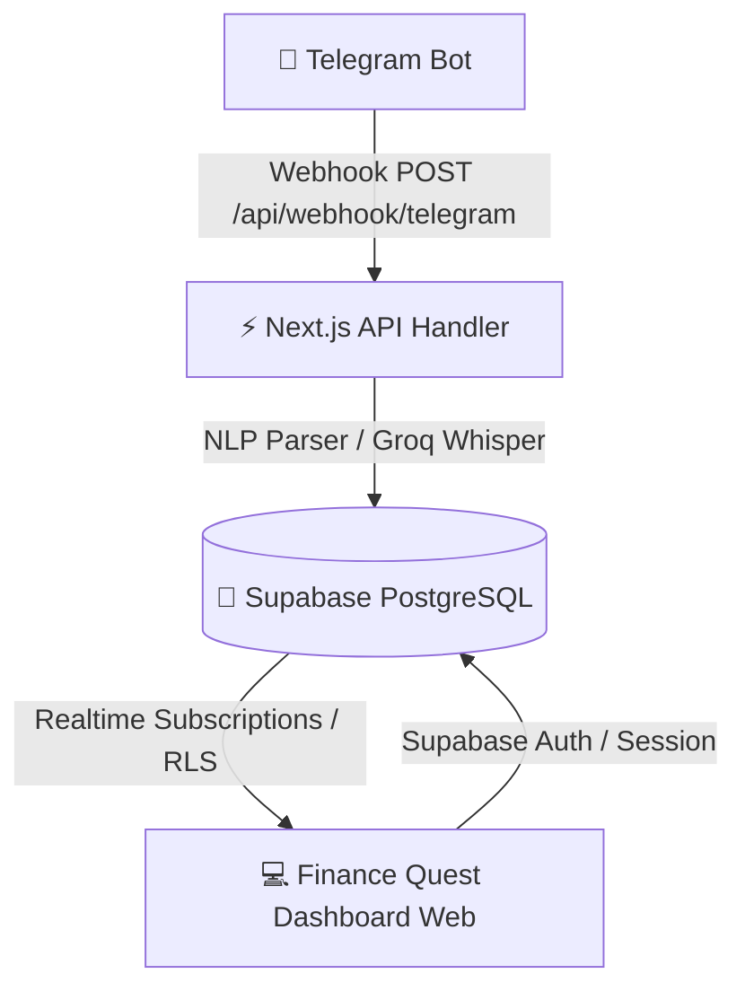

# 🐉 Finance Quest

> **Controle financeiro ultra-acessível e gamificado.**  
> Transforme o hábito de registrar despesas em uma jornada com mascote emocional (**Finny**), barra de vida (**HP**), pontos de experiência (**XP**), níveis, streaks diários e entrada instantânea de gastos via **Bot do Telegram** (texto e áudio de voz).

---

## 📸 Funcionalidades Principais

- ⚡ **Entrada Ultra-Rápida pelo Telegram:** Registre gastos enviando mensagens de texto (`35 almoço`, `120 internet fixo`) ou áudios de voz diretamente para o bot. O bot responde em tempo real com seu HP, Streak e ganho de XP.
- 🐉 **Finny, o Mascote Emocional:** Reage dinamicamente à sua saúde orçamentária (`THRIVING`, `HAPPY`, `WARNING`, `DANGER`, `CRITICAL`).
- ❤️ **Motor de HP (Health Points):** Algoritmo que calcula o ritmo ideal de gastos variáveis por dia do mês, penalizando excessos e recompensando a disciplina.
- 🔥 **Streak Flame & Gamificação:** Mantenha a sequência diária de registros ativa para ganhar bônus de XP e desbloquear insígnias.
- 🔐 **Autenticação Multi-usuário (Supabase Auth):** Cadastro e login seguros com e-mail e senha, com provisionamento automático de perfil e gamificação via PostgreSQL Triggers.
- 🔄 **Sincronização em Tempo Real (Supabase Realtime):** Atualização instantânea do dashboard web no momento em que uma despesa é lançada pelo Telegram ou por outro dispositivo.
- 📱 **PWA & Mobile-First:** Design responsivo com suporte a instalação na tela de início do iOS e Android.

---

## 🏗️ Arquitetura do Sistema



### Stack Tecnológica

| Camada | Tecnologias |
| :--- | :--- |
| **Frontend** | [Next.js 16](https://nextjs.org/) (App Router), [React 19](https://react.dev/), [Tailwind CSS](https://tailwindcss.com/), [Framer Motion](https://www.framer.com/motion/), [Lucide Icons](https://lucide.dev/), [Recharts](https://recharts.org/) |
| **Backend & APIs** | Next.js Edge/Node Route Handlers, Telegram Bot Webhook API |
| **Banco de Dados & Auth** | [Supabase](https://supabase.com/) (PostgreSQL, Supabase Auth, Row Level Security, Realtime Publications) |
| **Testes Automatizados** | [Vitest](https://vitest.dev/) (27 testes unitários cobrindo engine de HP, Streaks, Parser NLP e Repositório) |
| **Hospedagem & CI/CD** | [Vercel](https://vercel.com/) |

---

## 🚀 Como Executar Localmente

### 1. Clonar o Repositório
```bash
git clone https://github.com/FassinaRafael/finance-quest.git
cd finance-quest
```

### 2. Instalar Dependências
```bash
npm install
```

### 3. Configurar Variáveis de Ambiente
Crie um arquivo `.env.local` baseado no `.env.example`:

```bash
cp .env.example .env.local
```

Preencha as chaves:
```ini
# Supabase
SUPABASE_URL=https://your-project.supabase.co
SUPABASE_ANON_PUBLIC_KEY=your_anon_jwt
SUPABASE_SERVICE_ROLE_KEY=your_service_role_jwt

# Client-Side Supabase (Next.js)
NEXT_PUBLIC_SUPABASE_URL=https://your-project.supabase.co
NEXT_PUBLIC_SUPABASE_ANON_KEY=your_anon_jwt

# Telegram Bot
TELEGRAM_BOT_TOKEN=your_bot_token
TELEGRAM_WEBHOOK_SECRET=your_webhook_secret
TELEGRAM_ALLOWED_CHAT_IDS=your_chat_id
```

### 4. Executar Migrações do Banco
No **SQL Editor** do Supabase, execute o script:
- [`supabase/migrations/001_auth_provisioning_rls.sql`](supabase/migrations/001_auth_provisioning_rls.sql)

### 5. Iniciar o Servidor de Desenvolvimento
```bash
npm run dev
```
Acesse [http://localhost:3000](http://localhost:3000).

---

## 🧪 Testes Automatizados

Para rodar a suíte completa de testes unitários:

```bash
npm test
```

---

## 📜 Licença

Este projeto é desenvolvido para fins educacionais e de produtividade pessoal.
